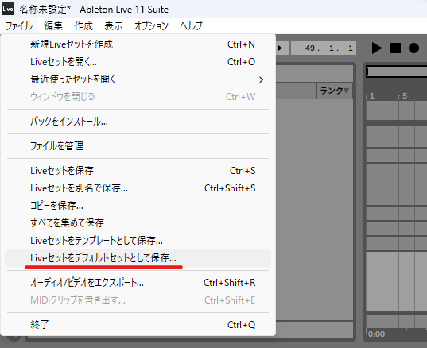
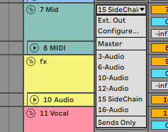
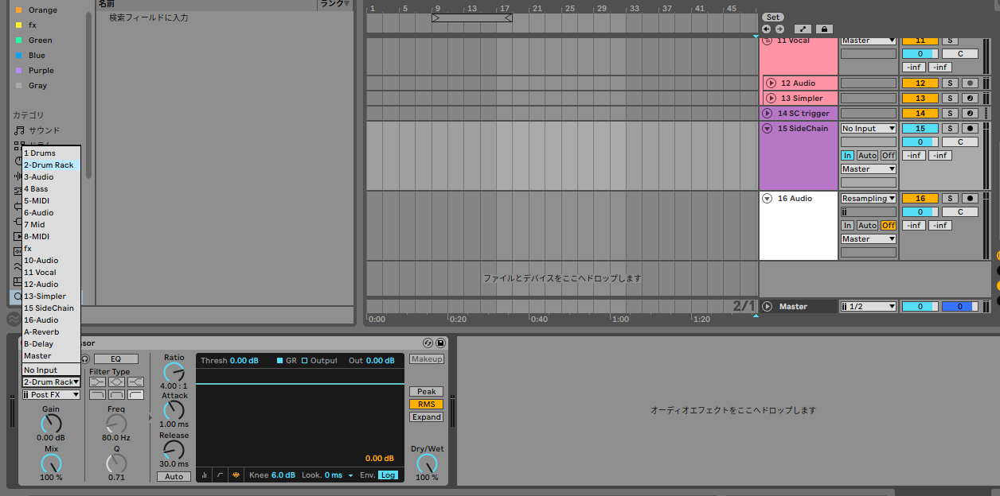
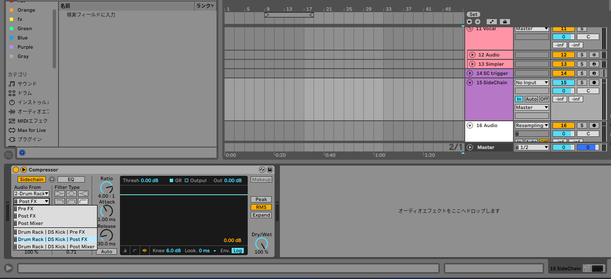
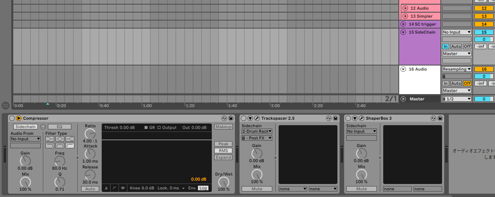
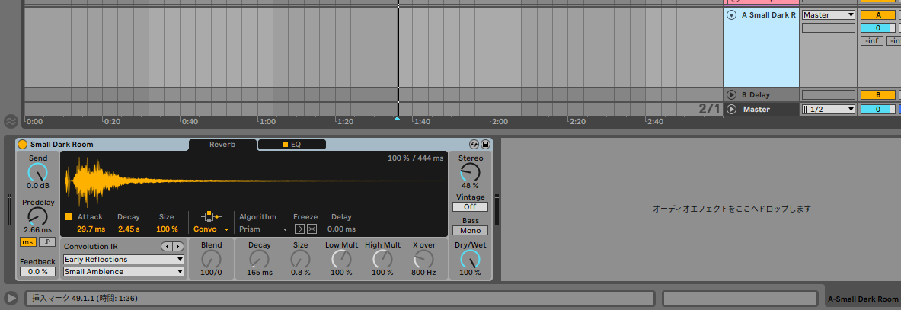

## Liveセットとは

他のDAWで言うところの、テンプレートのこと。  
デフォルトのLiveセットを設定することで、DAWを開いた時のトラックやルーティングをカスタマイズすることができる。

詳しくは、Ableton公式のヘルプをご参照ください。  
[Liveセットの新しいテンプレートや空のテンプレートを設定する](https://help.ableton.com/hc/ja/articles/209067189-Liveセットの新しいテンプレートや空のテンプレートを設定する)

{/* truncate */}

## 前置き

(見なくてもいいよ)

私は真っさらな白紙より、じゆうちょうの隙間の方が絵が描けたタイプだった。
つまりは、音楽においても、とっ散らかってる方がアイデアが出やすい。  
しかしながら、既に頭の中のアイデアを形にする時には、ある楽器が所定の位置に収まっていた方が都合がいい。  
つまり、これから紹介することは、あくまでも一例に過ぎないということである。

## グループ分け (色分け)

ドラム、ベース、ボーカルなど大まかにグループ分けをしておくと良いです。トラック数が多くなった時やその後のMixが楽になります！

自分の場合は、
- Drums (紫)
- Bass (青)
- Mid (緑)
- Vocal (赤)

のように、分けています。

また、グループの名前も付けておきましょう！  
今後、他の記事で紹介したいと思いますが、
他のプロジェクトのトラックをインポートするときに、名前を付けておかないと痛い目をみます…(反省)

## サイドチェインの設定

**ドラムはデカければデカいほどいい**

そうですよね…？

それは、言い過ぎたかもしれませんが、他のトラックの音量を抑え、
ドラムを埋もれないようにする為には、サイドチェインが有効です。

Side Chain 用のオーディオトラックを作成して、Master から Side Chain に変更します

面倒なルーティングに加え、コンプレッサーやその他のプラグインの設定などもしておきます。

Compressorのサイドチェイン

Drum Rackを使っている場合は、適当なキックを入れておいて、Audio From の設定までしておくと良いです。

プラグインを使用して( Track Spacer, Shaper Box など ) サイドチェイン、ダッキングすることもあるので、プラグインのルーティングも設定をしておきます。  
どのサイドチェインを使うかは、作る曲のジャンルや曲調によって変えています。

## センド

私自身も、センドは上手く使えてないですが、
取り敢えず、お気に入りのリバーブやディレイを置いておきましょう。

## マスター

保険の為のLimiterや、メーター系を挿しておきます。

リミッター以外はプロジェクトの最初の段階では使わないのでオフにしておいても良いでしょう。

## さいごに

今回紹介した、設定を取り入れたり、取り入れなかったりして、快適なDTMライフお送り下さいませ。
