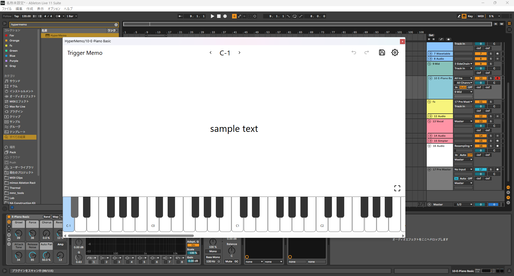

MIDIトリガー メモプラグイン

一旦完成



友達が欲しいと言っていたので、MIDIトリガー機能のあるメモプラグインを作っていました。

WebView周りに色々苦戦し、結局一か月くらい掛かったな、、、

zustandを使っていい感じに、JUCEとの連携が出来るProviderが出来たので、記事にしてまとめたいな、、、

フロントエンド部分だけだけど、核となる部分のコードはだいたいこんな感じ、


<Details
  summary="providers/juce.tsx"
>
```tsx
import { getNativeFunction } from 'juce-framework-frontend-mirror'
import { createContext, PropsWithChildren, useCallback, useContext, useEffect, useRef, useState } from 'react'
import { createStore, useStore } from 'zustand'

type SharedState = {
  someState: string
  // ...
}

type FrontendState = {
  modalIsOpen: boolean
}

type State = SharedState & FrontendState

type Action = {
  undo: () => void
  redo: () => void

  setSomeState: (v: string) => void
  setModalIsOpen: (v: boolean) => void // only frontend
}

type JuceStore = ReturnType<typeof createJuceStore>

const createJuceStore = (initProps: Partial<State>) => {
  const loadState = getNativeFunction('loadState')
  const changeState = getNativeFunction('changeState')
  const undo = getNativeFunction('undo')
  const redo = getNativeFunction('redo')

  const load = async () => {
    return {
      someState: await loadState('someState'),
    }
  }

  const DEFAULT_STATES: State = {
    someState: 'midi',
    modalIsOpen: false,
    canUndo: false,
    canRedo: false,
  }

  return createStore<State & Action>()((set) => ({
    ...DEFAULT_STATES,
    ...initProps,
    undo: () => {
      undo().then(() => {
        load().then((states) => {
          set(() => states)
        })
      })
    },
    redo: () => {
      redo().then(() => {
        load().then((states) => {
          set(() => states)
        })
      })
    },
    setSomeState: (v) =>
      set(() => {
        changeState('someState', v)
        return { someState: v }
      }),
    setModalIsOpen: (v) => set(() => ({ modalIsOpen: v })),
  }))
}

const JuceContext = createContext<JuceStore | null>(null)

type JuceProviderProps = PropsWithChildren<Partial<State>>

/** remove undefined in object. */
function cleanObject<T extends object>(obj: T): Partial<T> {
  return Object.fromEntries(
    Object.entries(obj).filter(([, v]) => v != undefined)
  ) as Partial<T>
}

export function JuceProvider({ children, ...props }: JuceProviderProps) {
  const storeRef = useRef<JuceStore>(null)
  const [savedStates, setSavedStates] = useState<Partial<State>>({})

  const loadInitialData = useCallback(() => {
    const data = window.__JUCE__.initialisationData
    return cleanObject<SharedState>({
      someState: data.someState?.[0],
    })
  }, [])


  if (!storeRef.current) {
    const initials = loadInitialData()
    storeRef.current = createJuceStore({...savedStates, ...initials, ...props})
  }

  useEffect(() => {
    if (storeRef.current) {
      storeRef.current.setState({...savedStates, ...props})
    } else {
      const initials = loadInitialData()
      storeRef.current = createJuceStore({...savedStates, ...initials, ...props})
    }
  }, [loadInitialData, props, savedStates])

  useEffect(() => {
    const onChangeCanUndoOrRedoId = window.__JUCE__.backend.addEventListener(
      'onChangeCanUndoOrRedo',
      ([canUndo, canRedo]) => {
        setSavedStates({...savedStates, canUndo, canRedo})
      }
    )

    return () => {
      window.__JUCE__.backend.removeEventListener(onChangeCanUndoOrRedoId)
    }
  }, [savedStates])

  return (
    <JuceContext.Provider value={storeRef.current}>
      {children}
    </JuceContext.Provider>
  )
}

export function useJuceContext<T>(selector: (state: State & Action) => T): T {
  const store = useContext(JuceContext)
  if (!store) throw new Error('Missing JuceContext.Provider in the tree')
  return useStore(store, selector)
}
```
</Details>

undo, redoは、juceのUndoManagerに任せて、フロントで状態を更新するというような仕様となっている
