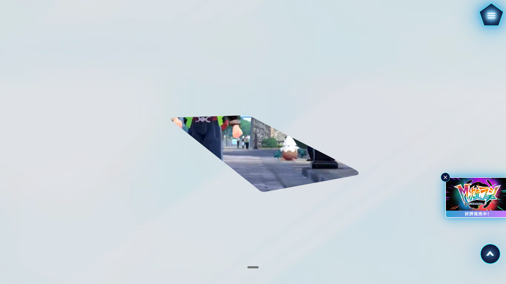

先日発売された、ポケモンの新作のホームページ [『Pokémon LEGENDS Z-A』公式サイト](https://www.pokemon.co.jp/ex/legends_z-a/ja/) が面白かったので、DevTools などを使い実装を見てみる。

## ライブラリ/フレームワーク

[Wappanalyzer](https://chromewebstore.google.com/detail/wappalyzer-technology-pro/gppongmhjkpfnbhagpmjfkannfbllamg?hl=ja) というChrome拡張を用いると、使用しているライブラリやフレームワークを簡単に調べることができる。

他にも色々出てくるけど、主要なところだと、

- [GSAP](https://gsap.com/)
- [Three.js](https://threejs.org/)

を使っているらしい。

GSAP は、アニメーションのためのライブラリで、ScrollTrigger で簡単にスクロールに基づいたアニメーションを作成できる。

Three.js は WebGL のための JavaScript 3D ライブラリで、3Dを扱うなら定番のライブラリ。

## ここ好きポイント

### clip-path を使った演出

背景に動画が流れていて、それがclip-path で広がっていくみたいな感じ演出。

サイト全体を通して、使用されている

### ダイナミックなグリッド

### ページに終わりがない

サイトはいくつかのセクションで構成されていて、最後の 「商品・特典」から下にスクロールしてくと、一番最初に戻ってくるようになっている。
