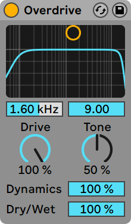

みなさんは、Ableton Liveの付属のエフェクトであるOverdriveを使っているだろうか？

至って普通のディストーションかもしれないが、使い勝手が良いし、Live標準のエフェクトなので動作も軽い。

パラメーターは、

preフィルター (バンドパス) セクション, 
Drive, Tone (postフィルター), Dynamics, Dry/Wet

という構成。

特に、[Dynamics] スライダーが良くて、Dynamicsを上げると、歪みが目立つようになり、逆に小さい値のときには、少ない歪みで音を太くさせるような印象があります。

特に生楽器系には、Dynamicsを小さめに、ベースやリードには大きめの値で使っていることが多い

X-Yコントローラーのフィルターセクションも直感的で使いやすい。
